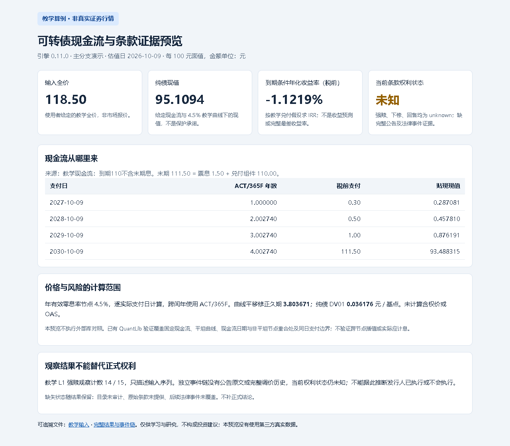

# 可转债定价与博弈引擎

独立实现的 A 股可转债研究工具，用于可审计现金流、收益率、条款观察与证据诊断。

## 结果预览与最短演示



截图来自[实际生成的 HTML 报告](docs/preview/report.html)，对应[教学输入](docs/preview/input.json)和[完整结果](docs/preview/result.json)。估值日为 2026-10-09，金额按每 100 元面值；纯债现值取决于假设曲线，条件收益率不是预测，条款缺证据保持未知。未使用第三方真实行情。

Python 3.10+，在仓库根目录运行；离线演示没有第三方运行依赖：

```sh
python -m pip install .
python -m cbengine.preview examples/demo.json --out-dir local-data/preview-first-run
```

打开 `local-data/preview-first-run/report.html`，同时生成 `input.json` 和 `result.json`。输出目录已存在会拒绝运行，请换一个新目录；不会覆盖旧结果。应看到全价 **118.50 元**、纯债现值 **95.1094 元**、税前到期条件年化收益率 **-1.1219%** 和当前条款 **未知**。见[生成与截图说明](docs/RESULT_PREVIEW.md)。

新增[交互报告](docs/interactive-preview/report.html)：按类别筛选、同单位排序，比较冻结的曲线风险情景并另存参数及版本。见[交互说明](docs/INTERACTIVE_PREVIEW.md)，不在浏览器重新定价。

## 当前版本与其他入口

已发布 [v0.11.0](https://github.com/KILING-TASI/convertible-bond-engine/releases/tag/v0.11.0)。上述教学预览入口是主分支新增演示，尚未进入该发布标签；版本号仍为 0.11.0。原设计中的含权定价与博弈模型尚未实现。

已有 `cb-engine examples/demo.json --out local-data/result.json` 输出完整 L1 JSON；市场快照支持 Markdown 和中文 HTML 资料卡。显式联网查询需 `python -m pip install ".[market]"`，再运行 `cb-engine --code 113042 --out local-data/snapshot.json`。113042 为历史验收代码，不代表当前仍存续；接口失败保留来源和缺口。更多操作见[使用与验收详解](docs/USAGE_AND_EVIDENCE.md)。

## 已实现与边界

| 已实现 | 使用边界 |
| --- | --- |
| 按日期现金流的纯债现值、税前/税后收益率、条件退出收益率 | 显式现金流与税额；已提供情景最小收益率不等于完整 YTW |
| 转股价值、溢价率、曲线平移久期、DV01、凸性与重估 | 债底取决于给定信用曲线及兑付假设，不承诺本金或流动性保护 |
| 批量筛选、排除原因与持仓汇总 | 需要完整 L1 输入；市场快照不能直接代替定价输入 |
| 原始条款、公告候选、正文底稿、PDF 字段匹配与本地档案 | 字面匹配及摘要不认证原文真实性或完整法律解释 |
| 自建条款观察、事件链与公告分页证据 | 条件计数与正式权利分离；自声明完整不能确认当前条款状态 |
| 可选 QuantLib 固定现金流对照 | 不包含中国转债含权模型；非平坦只验证现金流与零息节点重合处 |

尚未实现含权理论价、OAS、BS Greeks、隐含波动率、评级迁移、Merton PD、LSM、交易回测或交易执行。实际应计息、完整调价链与停牌计数约定仍待核验。

## 输入与关键口径

完整字段见[教学单债输入](examples/demo.json)和[接入契约草案](docs/INTEGRATION_CONTRACT.md)。

- 金额按每 100 元面值；`dirty_price` 为全价。净价必须加显式应计息，不能把第三方报价自动视为已核实全价。
- 利率、收益率与溢价率参数用小数，例如 `0.045` 为 4.5%。现金流按实际支付日和 ACT/365F 计算；日期统一 `YYYY-MM-DD`。
- `coupon` 与 `redemption` 不得重复含息。例如含末期息 4 元的总兑付 112 元，应拆为 4＋108，而非 4＋112。税率及税额由调用者明确提供。
- L1 曲线为包含信用因素的年有效零息曲线，逐期限线性插值、拒绝外推；未经转换的到期收益率曲线不能直接替代。独立现金流 IRR 不需要曲线。
- 条款逐只提供来源、有效期、窗口、门槛、严格或含等号比较及历史有效转股价，不使用通用默认阈值。强赎条件满足不等于发行人已执行。
- 公告日、生效日、行情日、取得日和评估截止日分别保留。缺交易日、未核实调价历史或停牌约定时，不补价、不补正式权利结论。

## 输出、来源与缺失状态

JSON 保留输入来源、假设与缺口；市场资料卡区分第三方报价/估值、人工底稿、实际 PDF 字段检查和自建观察。`unknown` 不等于安全，`partial` 不等于完整覆盖。目录 `pagination_observed` 只说明本次发行人和区间的返回分页一致，法律事件覆盖仍可能未知。

市场查询失败返回退出码 3，本地无效输入返回 2；具体模块的拒绝条件见详解。JSON 拒绝重复键、NaN、Infinity 及溢出。归档摘要用于检测内容一致性，没有外部签名或可信时间戳。

- [公告分页覆盖](docs/DIRECTORY_COVERAGE.md)：请求区间、逐页原始响应、数量及失败记录。
- [事件链设计](docs/EVENT_CHAIN_DESIGN.md)：原始条款与当前状态、截止日和生效日。
- [规则纠错登记](docs/rule-corrections.json)：14 项纠错及待核事项；规则参考核对日为 2026-10-09，未来使用需重新核对。

## 验证范围

```sh
python -m unittest discover -s tests -v
python -m cbengine.crosscheck examples/crosscheck-flat.json --out local-data/check.json
```

v0.11.0 本地 90 项测试通过；GitHub 检查覆盖 Python 3.10、3.12、3.13，另设可选 QuantLib 1.43 检查。核心未安装 QuantLib 时外部测试跳过，未运行的对照标记为 `not-run`。

QuantLib 实际验证平坦曲线、非平坦零息节点及同日支付边界；应计息仍为输入声明。FinancePy 仅读取许可和公开接口，未复制、导入或执行其代码。见[外部交叉验证说明](docs/EXTERNAL_CROSSCHECK.md)。

2026-10-09 上银真实样本曾取得公告 69 条、3 页，核对两份实际 PDF 的指定字段；这不代表全量条款、其他证券或接口长期可用。详细日期、数值与限制保留在[验收详解](docs/USAGE_AND_EVIDENCE.md)。

## 后续路线

见[实施路线与验收边界](ROADMAP.md)及[更新记录](CHANGELOG.md)。优先补真实数据与历史事件，再做含权模型及样本外验证。

## 与其他仓库的关系

参考 [research-workbench](https://github.com/KILING-TASI/research-workbench) 的证据留存、版本化知识卡与数据质量分层思路，核心独立实现。接入契约与本地脚本同输入对照已提供，尚未修改或完成工作台仓库迁移；本地参考脚本不代表其 GitHub 主分支。

研究参考包括 [QuantLib](https://github.com/lballabio/QuantLib)、[AKShare](https://github.com/akfamily/akshare) 和 [sw1507/convertibleBond](https://github.com/sw1507/convertibleBond)，不表示兼容其全部能力。

## 许可与第三方数据

本仓库原创代码及有权授权的原创说明沿用 [MIT 许可](LICENSE)。[许可范围与第三方清单](THIRD_PARTY_NOTICES.md)单列外部依赖、公告短摘录、规则事实与数据来源；它们未被整体重新授权。第三方组件分别遵循各自许可，行情、公告和 PDF 的使用权由提供方决定；代码许可不授予第三方数据使用权。仓库不分发用户原设计或真实 PDF，本地归档分享前须核对资料权限。

## 免责声明

仅供学习与研究，不构成投资建议或交易指令，不保证收益或准确性。请阅读[免责声明与使用边界](DISCLAIMER.md)，结合来源、假设与缺口独立判断。
